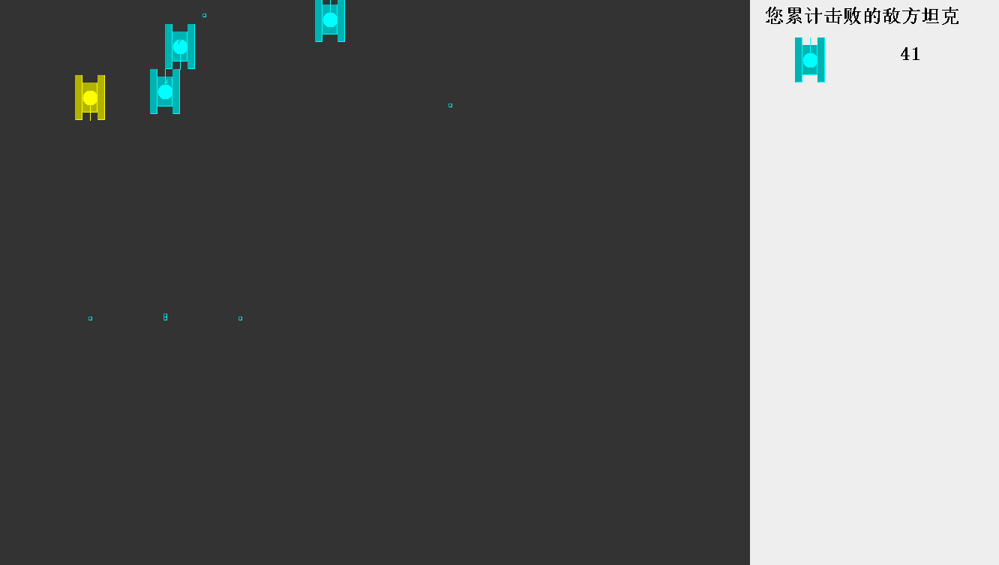
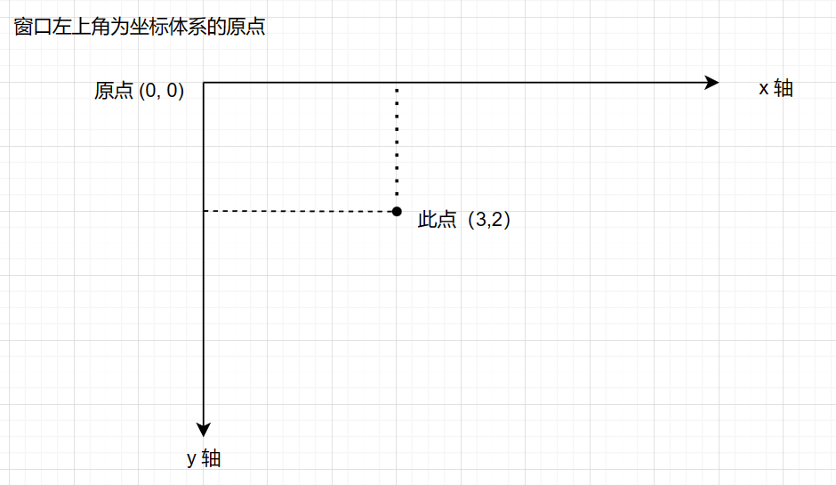
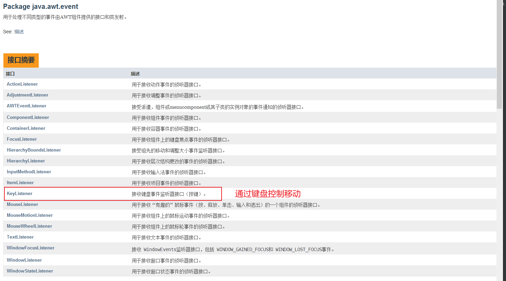
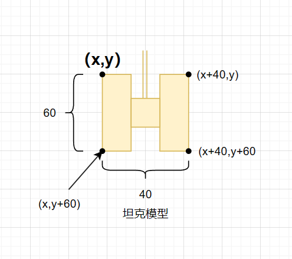
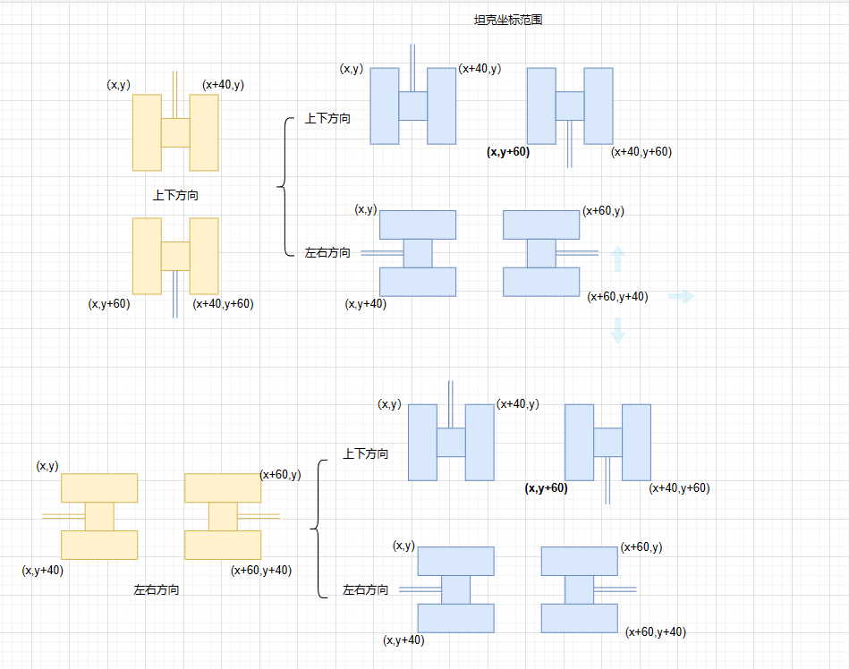

# 坦克大战
 🚀 这是我在学习 Java 基础时第一个较为正式的项目（**跟做**），只使用基础的 Java 知识，视频教程是 ：【【零基础 快速学Java】韩顺平 零基础30天学会Java】 https://www.bilibili.com/video/BV1fh411y7R8/?share_source=copy_web&vd_source=57b5284b7f71eaf337f0c159cae09c41

这个项目是从头开始将代码放在 Github 仓库的，我通过 Git 来进行代码提交更新，在学习巩固 Java 基础的同时实践 Git 的相关操作。

虽然是跟做，但也是收获颇多，总结了一份不正式的开发文档（开发过程的总结）。
如有需要，可做参考。

## 效果图

## 开发涉及到的知识点（基础）
- Java 面向对象编程
- 多线程
- 文件 I/O 操作
- 数据库

## 游戏界面
### Java 绘图坐标体系

### Java 绘图技术
Component 类提供了两个和绘图相关的重要方法：

- paint(Graphics g)    ：  绘制组件外观
- repaint()     ： 刷新组件外观

> 当组件第一次在屏幕显示的时候，程序会自动调用 paint()  方法来绘制组件

在这三种情况下 paint()  方法将会被调用：

1. 窗口最小化，再最大化
2. 窗口的大小发生变化
3. repaint()  方法被调用

Graphics 类（图形类）是所有图形上下文的抽象基类，允许应用程序在各种设备上实现的组件以及屏幕外图像上绘图。
我们以此类来进行坦克及其他元素的绘制。

**主要方法：**

1.画直线：drawLine(int x1,int y1,int x2,int y2)  

2.画矩形边框：drawRect(int x,int y,int width,int height)

3.画椭圆边框：drawOval((int x,int y,int width,int height)

4.填充矩形：fillRect(int x,int y,int width,int height)

5.填充椭圆：fillOval(int x,int y,int width,int height)

6.画图片：drawlmage(Image img,int x,int y,)

7.画字符串：drawString(String str,int x,inty)

8.设置画笔的字体：setFont(Font font)

9.设置画笔的颜色：setColor(Color c)

官方文档

https://docs.oracle.com/javase/8/docs/api/

### Java 事件处理机制
java 事件处理是采取 “**委派事件模型**” 。当 事件发生时，产生事件的对象会把此 “ 信息 ”  传递给 “事件的监听者”  处理。 “信息”  即 java.awt.event  是事件类库里某个类所创建的对象，把它称之为 “事件的对象” 。

事件源：事件源是一个产生事件的对象，比如按钮、窗口等。

事件：事件就是承载事件源状态改变时的对象，比如当键盘事件、鼠标事件、窗口事件等会产生一个事件对象，该对象保存着当前事件很多信息，比如 KeyEevent 对象有被按下键的 code 值。

目前游戏中有两个事件：
- `W A S D` 方向键控制玩家坦克的移动
- `鼠标左键` 控制子弹的发射（视频教程中是 `J` 键）

**java.awt.event 包 和 javax.swing.event 包中定义了各种事件类型。**

## 游戏分解 9 个类
`Tank` 类 定义了坦克的相关属性（角色、方向、坦克的坐标）以及移动坦克的四个方法 `moveUp`、`moveDown`、`moveDown`、`moveLeft`、`moveRight`。

`Hero` 类继承了 Tank 类，相当于是玩家坦克。

`MyPanel` 类继承了 JPanel 类以及 KeyListener 接口类，在此类中定义了画绘制坦克的方法 `DrawTank`, 监听按键并调用相应移动方法的`keyPressed`。

`Shot` 类 定义了子弹的属性（横纵坐标、方向、速度）及方法，继承了 `Thread`，相当于是一个线程。

`Bomb` 类 定义了炸弹效果类 ，我们使用三张图片来实现爆炸效果。

`TankGame` 类则是程序的主类，完成程序初始化。
在Swing中，任何其他组件都必须位于一个顶层容器中。JFrame 窗口和 JPanel 面板是常用的顶层容器。

**坦克的绘制**

坦克模型图：

坦克是由五部分组成，我们通过以下方法进行绘制：
- fillRect(int x,int y,int width,int height), 其中 `x` 和 `y` 是矩形相对于坐标系原点的横纵坐标，`width` 和 `height` 是矩形的宽高。
- fillOval(int x,int y,int width,int height), 其中 `x` 和 `y` 是椭圆相对于坐标系原点的横纵坐标，`width` 和 `height` 是宽高，相等时即为圆。
- drawLine(int x1,int y1,int x2,int y2), 其中`(x1,y1)` 和 `(x2,y2)` 是坦克炮筒（直线）的起点和终点坐标。
  

`super.paint(g);` 调用父类方法完成初始化,重写方法时不能删去。
~~~java 
@Override
    public void paint(Graphics g) {
        super.paint(g); // 调用父类方法完成初始化
        g.fillRect(0,0,1000,750);// 填充矩形，默认黑色

        // 画出坦克 将其封装为单独的方法
        drawTank(hero.getX(), hero.getY(), g,hero.getDirect(),0);

    }
~~~

### Tank 类

`Tank` 类 定义了坦克的相关属性（坦克的坐标、方向、存活）以及移动坦克的四个方法 `moveUp`、`moveDown`、`moveDown`、`moveLeft`、`moveRight`。

游戏主要分为 `玩家` `敌人` 两种角色（坦克类型），都是 `Tank` 的子类。

| 属性              | 含义                         | 方法（set get 及构造方法省略） | 用途     |
| ----------------- | ---------------------------- | ------------------------------ | -------- |
| `int x`   `int y` | 坦克的横纵坐标               | `moveUp`                       | 向上移动 |
| `int direct`      | 坦克的方向（发射子弹）       | `moveDown`                     | 向下移动 |
| `boolean isLive`  | 坦克是否存活（会被子弹击中） | `moveLeft`                     | 向左移动 |

### Shot 类

`Shot` 类 定义了坦克子弹的相关属性，这是一个 线程，继承于 `Thread`  类

游戏主要分为 `玩家` `敌人` 两种角色（坦克类型），都是 `Tank` 的子类。

| 属性              | 含义               | 方法（set get 及构造方法省略） | 用途                                         |
| ----------------- | ------------------ | ------------------------------ | -------------------------------------------- |
| `int x`   `int y` | 坦克子弹的横纵坐标 | `run`                          | 重写 线程的 `run` 方法，通过子弹方向进行移动 |
| `int direct`      | 坦克子弹的射击方向 |                                |                                              |
| `boolean isLive`  | 子弹是否有效       |                                |                                              |
| `int speed`       | 子弹的速度         |                                |                                              |

### Hero 类

`Hero` 类 继承于`Tank` 类，是`玩家坦克`，

| 属性                         | 含义 | 方法            | 用途                           |
| ---------------------------- | ---- | --------------- | ------------------------------ |
| 继承于 `Tank` 类，无新的属性 |      | `shotEnemyTank` | 射击敌方坦克，用于点击射出子弹 |

### EnemyTank 类

`Hero` 类 继承于`Tank` 类 和 `Runnable ` 类，是`敌方坦克（电脑控制）`。

| 属性                         | 含义 | 方法  | 用途                                         |
| ---------------------------- | ---- | ----- | -------------------------------------------- |
| 继承于 `Tank` 类，无新的属性 |      | `run` | 重写 线程的 `run` 方法，通过子弹方向进行移动 |

### Bomb类

`Bomb` 类 ，实现坦克被击中后的爆炸效果，一共由三张图片组成。

| 属性             | 含义         | 方法       | 用途       |
| ---------------- | ------------ | ---------- | ---------- |
| `int x ` `int y` | 炸弹的坐标   | `lifeDown` | 控制生命值 |
| `boolean isLive` | 炸弹是否有效 |            |            |
| `int life`       | 坦克的生命值 |            |            |

### AePlayWave 类

`AePlayWave ` 类 ，控制游戏音频的播放，音频格式为 `.wav` 。

| 属性              | 含义         |
| ----------------- | ------------ |
| `String filePath` | 音频文件路径 |

### Recorder 类

`Recorder` 类 ，记录玩家成绩，实现文件操作。

- 该类记录我方击毁敌方坦克数
- 当游戏结束，将击败数量写入到文件(myRecord.txt)
- 退出游戏时，记录当前有效坦克的数据（方向和坐标）

### MyPanel类

`MyPanel` 类, 是整个游戏的绘图区域，在这里进行游戏画面的绘制，实现游戏效果，继承于 `JPanel`、`KeyListenter` 、`MouseListener`、`Runnable` 类，实现重写了它们的一些方法。

*注意：*  视频教程中使用的是键盘`J` 来控制坦克的攻击（子弹发射），我这里换成了鼠标左键来控制，所以多了一个鼠标事件`MouseListener`  。

| 属性                | 含义           | 方法                       | 用途 |
| ------------------- | -------------- | -------------------------- | ---- |
| `int enemyTankSize` | 敌方坦克的数量 | 下方代码块  （具体看源码） |      |

~~~java
/**
 * @param x 坦克左上角的 x 坐标
 * @param y 坦克左上角的 y 坐标
 * @param g 画笔
 * @param direct 坦克的方向（上下左右）
 * @param type 坦克的类型
 */
// 画出坦克
public void drawTank(int x, int y, Graphics g, int direct, int type) {}
~~~

~~~java
/**
 * @param s 子弹
 * @param enemyTank 坦克
 */
// 判断我方坦克子弹是否击中敌方坦克
public void hitTank(Shot s, Tank enemyTank) {}
~~~

~~~java
// 判断敌方坦克子弹是否击中玩家坦克
public void hitHero() {}
~~~

~~~java
// 鼠标射击
public void mouseClicked(MouseEvent e) {
        // 射击
        if(e.getButton() == MouseEvent.BUTTON1) { //左键

            //  判断 玩家的子弹 是否销毁(单颗)
            //if( hero.shot == null || !hero.shot.isLive) {
            //    hero.shotEnemyTank();
            //}

            // 多颗不判断
            hero.shotEnemyTank();
        }
    }
~~~

~~~java
// 键盘事件 W A S D 四个键控制移动方向
public void keyPressed(KeyEvent e) {}
~~~

~~~java
// 绘制组件外观 实现画面的绘制
public void paint(Graphics g) {}
~~~

### TankGame01 类

`TankGame01 ` 类 是程序的主类，继承于`JFrame` 类，在这里调用其它类，实现效果。

~~~java
public class TankGame01 extends JFrame {
    // 定义 MyPanel
    MyPanel mp = null;
    public static void main(String[] args) {
        TankGame01 tankGame01 = new TankGame01();

    }

    public TankGame01() {
        mp = new MyPanel();
        Thread thread = new Thread(mp);
        thread.start();
        this.add(mp);

        this.setSize(1000,750);
        this.addKeyListener(mp);
        this.addMouseListener(mp);
        this.setDefaultCloseOperation(JFrame.EXIT_ON_CLOSE);
        this.setVisible(true);
    }
}
~~~

## 多线程

游戏中 `Shot` 和 `EnemyTank` 类 分别继承于 `Thread`  和 `Runnable` 类。

**继承 Thread 和 实现 Runnable 的区别：**

- 从 java 的设计来看，通过继承 Thread 或者实现 Runnable 接口本身来创建线程本质上没有区别。 Thread 类 本身就实现了 Runnable 接口。
- 实现 Runnable 接口方式更适合多个线程共享一个资源的情况，并且避免了单继承的限制。

**线程的常用方法**

~~~java
setName();  //设置线程名称，使之与参数name相同
getName();  //返回该线程的名称
start();  //使该线程开始执行：Java虚拟机底层调用该线程的start(0方法
run();   //调用线程对象run方法
setPriority(); //更改线程的优先级
getPriority(); //获取线程的优先级
sleep(); //在指定的毫秒数内让当前正在执行的线程休眠（暂停执行）
interrupt(); //中断线程
yield(); // 让出 CPU 让其他线程执行，不一定成功  
join(); // 线程的插队，一旦插队成功则先执行完插入的线程的任务
~~~

**线程同步机制**

线程同步，即当有一个线程在对内存进行操作时，其它线程都不可以对这个内存地址进行操作，直至该线程操作完成，其它线程才能对该内存地址进行操作。

~~~java
synchronized (对象) { //得到对象的锁，才能操作同步代码
    // 需要被同步代码
}

//  或者
public synchronized void m(String name) {
    // 需要被同步代码
}
~~~

**互斥锁**

- Java 语言中，引入了对象互斥锁的概念，来保证共享数据的完整性
- 每个对象都对应于一个可称为“互斥锁”的标记，这个标记保证在任一时刻只能有一个线程访问该对象
- 关键字 `synchronized` 来与对象的互斥锁联系，当某个对象用 `synchronized` 修饰时，表明该对象在任一时刻只能由一个线程访问
- 同步的局限性：导致程序的执行效率要降低
- 同步方法（非静态）的锁可以是 this，也可以说是其他对象（要求是同一个对象）
- 同步方法（静态）的锁为当前类本身

注意：

- 同步方法如果没有使用 static 修饰，默认锁对象是 this
- 如果方法使用了 static 修饰，默认锁对象为  当前类.class

**死锁：** 多个线程都占用了对方的锁资源，但不肯相让，导致了死锁。

 

**以下四种方法会释放锁：**

- 当前线程的同步方法、同步代码块执行结束
- 当前线程在同步代码块、同步方法中遇到 break、return
- 当前线程在同步代码块、同步方法中出现了未处理的 Error 或 Exception ，导致异常结束
- 当前线程在同步代码块、同步方法中执行了线程对象的 wait() 方法，当前线程暂停，并释放锁

**以下操作不会释放锁：**

- 线程执行同步代码块或同步方法时，程序调用 Thread.sleep() 、Thread.yield() 方法暂停当前线程的执行不会释放锁
- 线程执行同步代码块时，其他线程调用了该线程的 suspend()  方法将该线程挂起，该线程不会释放锁

## 基本功能实现后 下一步完善工作

在实现基本的坦克绘制、运动、控制等功能后，有一个最明显的问题：坦克可以重叠运动。

这显然是不行的，所以接着完善改进代码，首先要做的就是防止坦克的重叠运动，然后实现成绩存档（记录成绩并保存，退出游戏），最后是实现游戏的存档，即关闭游戏后可以选择上一次游戏进度或者新的一局游戏。

### 防止坦克重叠运动

**思路：判断坦克的定位坐标是否在一定范围内** 

- 根据坦克运动方向确定坦克定位坐标
  - 上   定位坐标（x,y）和（x+40,y）
  - 下   定位坐标（x,y+60）和（x+40,y+60）
  - 左   定位坐标（x,y）和（x,y+40）
  - 右   定位坐标（x,y）和（x+40,y）
- 坦克的每个方向都要和其他坦克四个方向（运动轨迹在一条直线上，所以两两一对）的坐标进行对比
  - 上 
    - 上下
    - 左右
  - 下
    - 上下
    - 左右
  - 左   
    - 上下
    - 左右
  - 右   
    - 上下
    - 左右

参考代码：

~~~java
case 0: // 上
// 与其他敌人坦克进行比较
for(int i = 0; i < enemyTanks.size(); i++) {
    EnemyTank enemyTank = enemyTanks.get(i);
    // 不和自己比较
    if(enemyTank != this) {
        /**
         * 敌人坦克方向   上下
         * 定位坐标 确定坦克范围 x:[enemyTank.getX(),enemyTank.getX() + 40]
         *                    y:[enemyTank.getY(),enemyTank.getY() + 60]
         * 当前坦克的左右上角坐标与之进行比较
         * 左上角坐标 [this.getX(), this.getY()]
         * 右上角坐标 [this.getX() +40, this.getY()]
         */
        if(enemyTank.getDirect() == 0 || enemyTank.getDirect() == 2) {
            // 比较左上角坐标 [this.getX(), this.getY()]
            if(this.getX() >= enemyTank.getX() 
               && this.getX() <= enemyTank.getX() + 40
               && this.getY() >= enemyTank.getY() 
               && this.getY() <= enemyTank.getY() + 60) {
                return true;
            }
            // 比较右上角坐标 [this.getX() +40, this.getY()]
            if(this.getX() + 40 >= enemyTank.getX() 
               && this.getX() + 40 <= enemyTank.getX() + 40
               && this.getY() >= enemyTank.getY() 
               && this.getY() <= enemyTank.getY() + 60) {
                return true;
            }
        }
        /**
         * 敌人坦克方向   左右
         * 定位坐标 确定坦克范围 x:[enemyTank.getX(),enemyTank.getX() + 60]
         *                    y:[enemyTank.getY(),enemyTank.getY() + 40]
         * 当前坦克的左右上角坐标与之进行比较
         * 左上角坐标 [this.getX(), this.getY()]
         * 右上角坐标 [this.getX() +40, this.getY()]
         */
        if(enemyTank.getDirect() == 1 || enemyTank.getDirect() == 3) {
            // 比较左上角坐标 [this.getX(), this.getY()]
            if(this.getX() >= enemyTank.getX() 
               && this.getX() <= enemyTank.getX() + 60
               && this.getY() >= enemyTank.getY() 
               && this.getY() <= enemyTank.getY() + 40) {
                return true;
            }
            // 比较右上角坐标 [this.getX() +40, this.getY()]
            if(this.getX() + 40 >= enemyTank.getX() 
               && this.getX() + 40 <= enemyTank.getX() + 60
               && this.getY() >= enemyTank.getY() 
               && this.getY() <= enemyTank.getY() + 40) {
                return true;
            }
        }
    }
}
break;
~~~

### 记录玩家成绩  保存退出游戏

记录玩家成绩是在文件上操作的，通过 `Recorder` 类中的操作文件的方法进行存储坦克的数据：坐标以及方向和子弹

~~~java
public class Recorder {
    // 定义变量 记录击败坦克数
    private static int allEnemyTankNum = 0;
    // 定义 IO 对象，将数据写到文件中去
    private static FileWriter fw = null;
    private static BufferedWriter bw = null;
    private static BufferedReader br = null;

    // 文件位置 自定义
    private static String recordFile = "d:\\myRecord.txt";

    //定义一个 Node 的 Vector  用于保存敌人坦克信息
    private static Vector<Node> nodes = new Vector<>();

    // 定义 Vector 指向 MyPanel 对象的敌人坦克 Vector
    private static Vector<EnemyTank> enemyTanks = null;

    public static void setEnemyTanks(Vector<EnemyTank> enemyTanks) {
        Recorder.enemyTanks = enemyTanks;
    }

    public static int getAllEnemyTankNum() {
        return allEnemyTankNum;
    }

    public static void setAllEnemyTankNum(int allEnemyTankNum) {
        Recorder.allEnemyTankNum = allEnemyTankNum;
    }

    // 当我方击毁一个敌方坦克时击败坦克数加一
    public static void addAllEnemyTankNum() {
        Recorder.allEnemyTankNum++;
    }

    // 读取 recordFile 文件信息 恢复数据
    public static Vector<Node> getNodeAndEnemyTankRec() {
        try {
            br = new BufferedReader(new FileReader(recordFile));
            allEnemyTankNum = Integer.parseInt(br.readLine());
            // 循环读取数据 恢复有效坦克数据
            String line = "";
            while ((line = br.readLine()) != null) {
                String[] xyd = line.split(" ");
                 Node node = new Node(Integer.parseInt(xyd[0]),Integer.parseInt(xyd[0]),Integer.parseInt(xyd[0]));
                 nodes.add(node);
            }
        } catch (IOException e) {
            throw new RuntimeException(e);
        } finally {
            if (br != null) {
                try {
                    br.close();
                } catch (IOException e) {
                    throw new RuntimeException(e);
                }
            }
        }

        return nodes;
    }

    // 当游戏退出时 保存信息
    public static void keepRecord() {
        try {
            bw = new BufferedWriter(new FileWriter(recordFile));
            bw.write(allEnemyTankNum + "\r\n");
            // 遍历敌人坦克的 Vector ，保存坐标和方向
            for (int i = 0; i < enemyTanks.size(); i++) {
                // 取出坦克
                EnemyTank enemyTank = enemyTanks.get(i);
                // 判断有效性
                if(enemyTank.isLive) {
                    String record = enemyTank.getX() + " " + enemyTank.getY() + " " + enemyTank.getDirect();
                    // 写入到文件
                    bw.write(record + "\r\n");
                }
            }

        } catch (IOException e) {
            throw new RuntimeException(e);
        } finally {
            if (bw != null) {
                try {
                    bw.close();
                } catch (IOException e) {
                    throw new RuntimeException(e);
                }
            }
        }
    }

    public static String getRecordFile() {
        return recordFile;
    }
}
~~~

### 存档游戏 or 新游戏

上一局游戏和新游戏此处实现的是控制台输入数字进行对应的初始化，涉及到的是 `I/O` 流的知识

- `1`  新一局游戏
  - 正常初始化页面
- `2`  上一局游戏
  - 先判断 存储信息的文件是否存在 存在则读取数据  不存在则提示新开一局游戏
  - 需要从 `myRecord` 文件中读取敌方坦克的数据 然后绘图
- 退出游戏
  - 主动退出   玩家主动关闭游戏窗口 保存信息
  - 被动退出   玩家坦克被击中 保存击败数 不保存敌方坦克信息  下一次游戏只能新开一局

~~~java
Scanner scanner = new Scanner(System.in);
System.out.println("请输入你的选择： 1. 新游戏   2.上一局游戏");
String key = scanner.next();
mp = new MyPanel(key);
~~~

~~~java
//  MyPanel 方法
public MyPanel(String key) {
    File file =new File(Recorder.getRecordFile());
    if(file.exists()) {
        nodes=Recorder.getNodeAndEnemyTankRec();
    }else {
        System.out.println("只能开启新游戏");
        key="1";
    }
    System.out.println(nodes);
    //记录文件获取敌人坦克
    Recorder.setEnemyTanks(enemyTanks);

    // 初始化玩家坦克
    hero = new Hero(100,100);
    hero.setDirect(2);

    switch (key) {
            // 新游戏
        case "1" :
            //初始化电脑坦克
            for(int i = 0; i < enemyTanksSize; i++) {
                EnemyTank enemyTank = new EnemyTank(100 * (1 + i), 0);

                // 创建坦克
                enemyTank.setEnemyTanks(enemyTanks);
                // 设置初始方向
                enemyTank.setDirect(2);
                // 启动
                new Thread(enemyTank).start();
                //给电脑坦克加子弹
                Shot shot = new Shot(enemyTank.getX(),enemyTank.getY(),enemyTank.getDirect());
                enemyTank.shots.add(shot);

                new Thread(shot).start();
                enemyTanks.add(enemyTank);

            }
            break;
            // 上局游戏
        case "2" :
            //初始化电脑坦克
            for(int i = 0; i < nodes.size(); i++) {
                Node node = nodes.get(i);
                EnemyTank enemyTank = new EnemyTank(node.getX(),node.getY());
                System.out.println(enemyTank);
                // 创建坦克
                enemyTank.setEnemyTanks(enemyTanks);
                // 设置初始方向
                enemyTank.setDirect(node.getDirect());
                // 启动
                new Thread(enemyTank).start();
                //给电脑坦克加子弹
                Shot shot = new Shot(enemyTank.getX(),enemyTank.getY(),enemyTank.getDirect());
                enemyTank.shots.add(shot);

                new Thread(shot).start();
                enemyTanks.add(enemyTank);

            }
            break;
        default:
            System.out.println("输入有误");
    }
    // 音乐
    new AePlayWave("TankGame/pages/Tank01.wav").start();
}
~~~

### 音频播放

音频的播放依然是读取音频文件播放

- 由于视频里的音频时间较短 我将其作为背景音乐进行循环播放

  ~~~java
  // 循环播放
  File soundFile = new File(filename);
  
          AudioInputStream audioInputStream = null;
          try {
              audioInputStream = AudioSystem.getAudioInputStream(soundFile);
              //循环播放背景音乐
              Clip clip = AudioSystem.getClip();
              clip.open(audioInputStream);
              clip.start();
              clip.loop(Clip.LOOP_CONTINUOUSLY);
          } catch (Exception e1) {
              e1.printStackTrace();
              return;
          }
  ~~~

## 待改进的地方

- **游戏窗口**
  - 游戏选择新游戏还是上一局游戏可以在击败数下方控制输出或者新的窗口进行输入
  - 在击败数 下方可以添加一个 开始暂停游戏
  - 敌方坦克被全部击败完时弹出通关或其他信息窗口  用户选择是否开始新游戏
  - 玩家坦克被击败时弹出游戏失败的窗口  选择是否继续游戏

- **音频**
  - 游戏发射子弹时可以添加音效
  - 坦克被击毁时添加音效
- **游戏对局**
  - `Recorder` 类可以更改为记录玩家坦克信息，这样选择上一局游戏时可以完全复现对局
  - 游戏被动退出（玩家被击败）时下一次无法选择上一局游戏

这几个地方等我再学习一段时间后再进行完善（*挖坑*），大概思路是这样，都是在此基础上进行扩充改变的。

